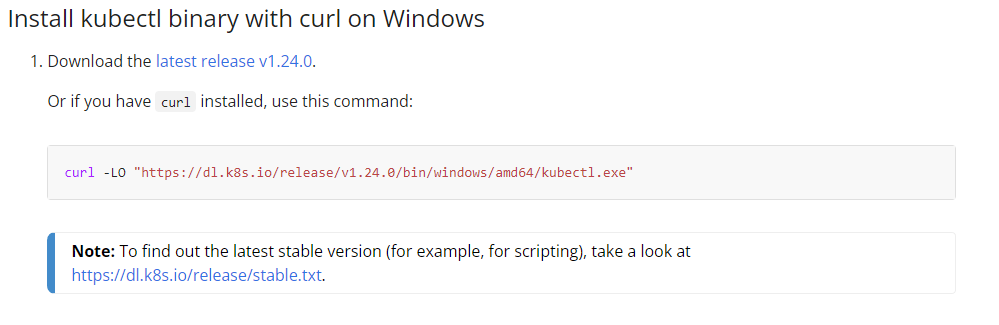
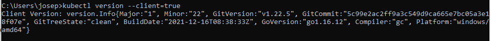
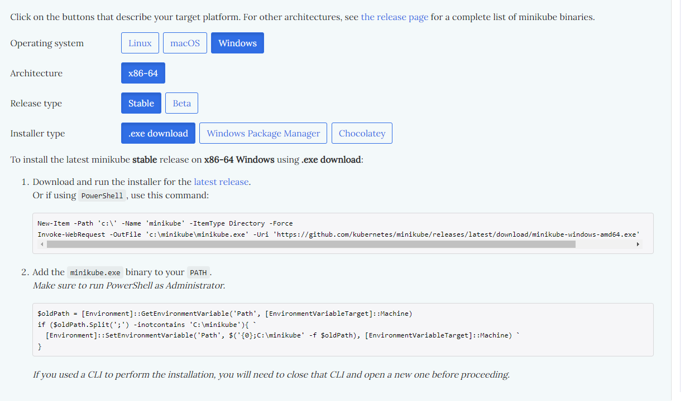
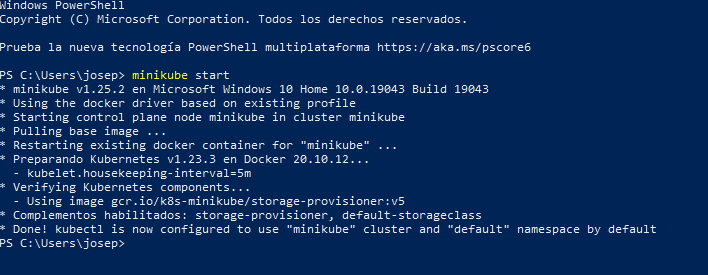

# Installation of minikube and kubectl

## Primero de todo instalamos kubectl

Nos dirigimos a la página de [kubectl](https://kubernetes.io/docs/tasks/tools/install-kubectl-windows/#install-kubectl-binary-with-curl-on-windows) y descargamos mediante un curl el cliente.

Comprobacion de la instalacion de kubectl

## El segundo paso es descargar minikube.

Nos dirigimos a la página de [minikube](https://minikube.sigs.k8s.io/docs/start/)

He seguimos las instrucciones:

Realizamos un *minikube start*:

